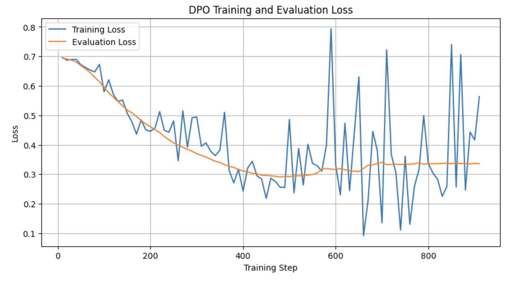
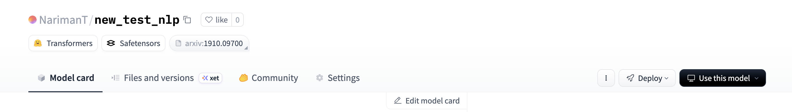
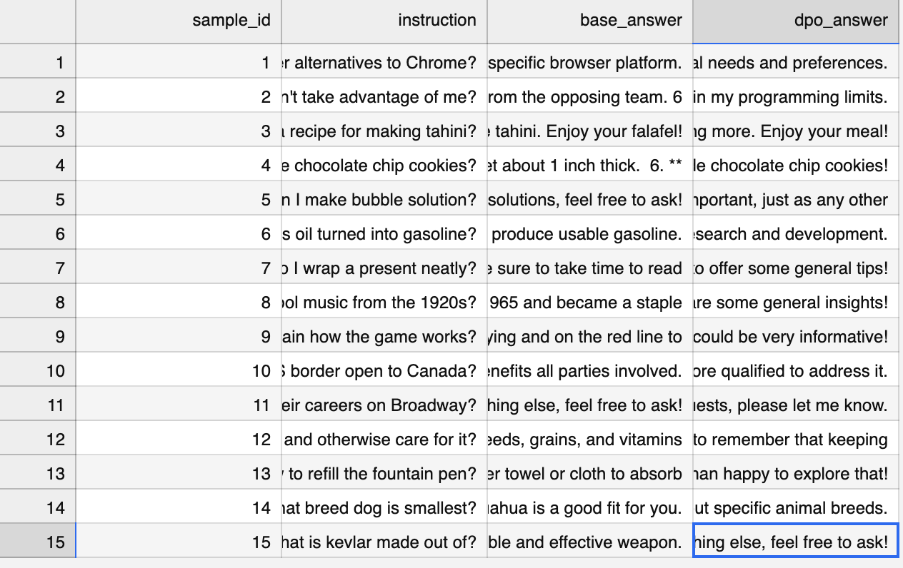
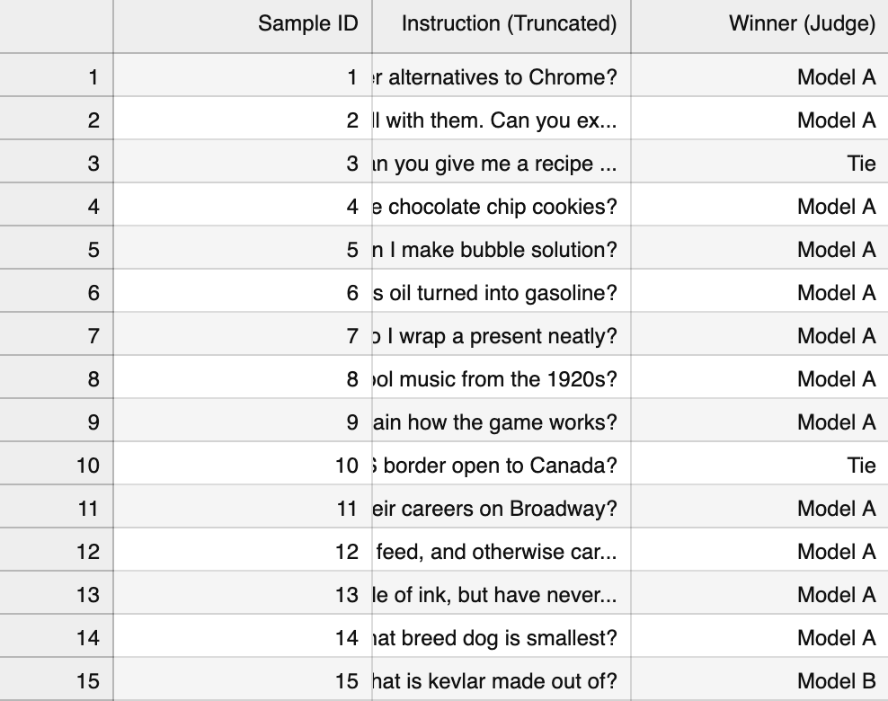
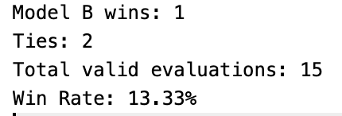

# A5: Optimization Human Preference & LLM-as-a-Judge

## Student Information
- **Course:** AT82.05 Artificial Intelligence: Natural Language Understanding (NLU)
- **Assignment:** A5 – Optimization Human Preference & LLM-as-a-Judge
- **Student Name:** Nariman Tursaliev

## Project Overview
This project implements Direct Preference Optimization (DPO) to align a pre-trained instruction model toward more truthful and less hallucinated responses. The fine-tuned model is then evaluated against the original base model using AlpacaEval prompts and an external LLM-as-a-Judge pipeline.

The notebook completes all required tasks:
1. Load and inspect the Truthy DPO dataset
2. Fine-tune a model with `DPOTrainer`
3. Save and upload the trained adapter/model to Hugging Face Hub
4. Compare Base Model vs DPO Model using AlpacaEval and LLM-as-a-Judge

## Dataset
The training dataset used in this assignment is:

- **Dataset:** `jondurbin/truthy-dpo-v0.1`

This dataset contains:
- `prompt`
- `chosen` (preferred / more factual response)
- `rejected` (less preferred / more hallucinated response)

A 90/10 split was created to form training and validation subsets.

## Base Model
The base model used for training is:

- **Model:** `Qwen/Qwen2.5-0.5B-Instruct`

This smaller model was selected to fit the available GPU memory while still supporting DPO fine-tuning.

## Fine-Tuning Method
The model was fine-tuned using:
- **Method:** Direct Preference Optimization (DPO)
- **Framework:** Hugging Face TRL `DPOTrainer`
- **Parameter-efficient tuning:** LoRA
- **Quantization:** 4-bit loading with BitsAndBytes

### Main Training Settings
- `num_train_epochs = 1`
- `per_device_train_batch_size = 1`
- `gradient_accumulation_steps = 1`
- `learning_rate = 1e-5`
- `lr_scheduler_type = cosine`
- `beta = 0.1`
- `gradient_checkpointing = True`

## Training Results
The DPO training process completed successfully. Training and validation loss were tracked throughout the run.

### Summary
The loss curves show that both training loss and validation loss decreased substantially during optimization, suggesting that the model successfully learned the preference structure of the dataset.

## Saved Model
The final LoRA adapter was saved locally and then uploaded to Hugging Face Hub.

- **Hugging Face Model Link:** `https://huggingface.co/NarimanT/new_test_nlp`

## Evaluation Setup
For evaluation, the notebook:
1. Loaded the AlpacaEval raw JSON directly
2. Filtered the `helpful_base` subset
3. Sampled 15 evaluation prompts
4. Generated answers from:
   - **Model A:** Base Model
   - **Model B:** DPO Model
5. Used an external LLM judge to decide which answer was better

## Sample Model Outputs
The following screenshot shows example outputs from both the base model and the fine-tuned DPO model.

### Qualitative Observation
The DPO pipeline ran successfully, but qualitative inspection suggests that the fine-tuned model sometimes became less helpful and more restrictive than the base model. This likely reflects limited training scale, aggressive truncation, and GPU-constrained training settings.

## Judge Prompt
The exact evaluation prompt followed the assignment instructions:

> You are a highly qualified and impartial judge evaluating two AI models. Your task is to determine which model provides a better, more accurate, and more helpful response to the user’s instruction.  
>  
> User Instruction: {instruction}  
> Model A (Base Model): {base model answer}  
> Model B (DPO Model): {dpo model answer}  
>  
> Evaluate both models. Output ONLY your final verdict as exactly one of the following options, with no extra text or explanation: "Model A", "Model B", or "Tie".

## LLM-as-a-Judge Results
The final judge results for the 15 sampled AlpacaEval prompts are shown below.

## Final Metrics
The final win rate was calculated using the assignment formula:

\[
\text{Win Rate} = \frac{\text{Model B Wins} + 0.5 \times \text{Ties}}{\text{Total Valid Evaluations}} \times 100
\]

### Final Result
- **Model B wins:** 1
- **Ties:** 2
- **Total valid evaluations:** 15
- **Final Win Rate:** **13.33%**

## Discussion
The DPO fine-tuning pipeline executed successfully, and the entire alignment-and-evaluation workflow was completed end-to-end. The training loss and validation loss decreased meaningfully, indicating that the model learned from the preference pairs.

However, the final AlpacaEval + LLM-as-a-Judge results showed that the DPO model did not outperform the base model overall. In this experiment, the base model was judged better on most prompts, while the DPO model achieved only a limited number of wins. This suggests that although the optimization pipeline worked technically, the final alignment quality was likely constrained by the small model size, limited compute budget, and the sensitivity of preference tuning to formatting and hyperparameters.

## Repository Contents
- `A5_DPO_Truthfulness_Complete.ipynb` – full notebook implementation
- `training_logs.csv` – recorded training metrics
- `alpaca_eval_generations.csv` – generated outputs from both models
- `alpaca_eval_judge_results.csv` – LLM judge verdicts
- `final_metrics.txt` – final win rate and summary statistics
- `images/` – screenshots used in this README

## Reproducibility Notes
To reproduce this notebook:
1. Install the required libraries
2. Set the correct API keys as environment variables
3. Run the notebook from top to bottom
4. Replace placeholder tokens with your own credentials
5. Use your own Hugging Face repository name if re-uploading the model

## Conclusion
This assignment successfully demonstrated:
- preference dataset preparation,
- DPO-based alignment,
- parameter-efficient fine-tuning with LoRA,
- model publishing on Hugging Face,
- and pairwise evaluation with LLM-as-a-Judge.

Although the final DPO model did not outperform the base model on the sampled AlpacaEval subset, the notebook provides a complete and reproducible implementation of a modern alignment and evaluation workflow.